# Neural_Network_Charity_Analysis
Author: Jerome Simmons

## Overview of the Analysis
We have built a binary classification neural network model for a foundation, AlphabetSoup. The neural network model assesses whether or not a donation from AlphabetSoup to a non-profit organization will be successful. The model was built on a dataset of 34k non-profit organizations that have received funding over the years.

## Results

### Data Preprocessing
The dataset consisted of 11 column types, which were removed or converted to features or targets.

#### Removed Columns
* EIN and NAME—Identification columns. These columns were removed, because they are not numerical and should have no bearing on whether or not a non-profit organization was successful with their donation.

##### Features
* APPLICATION_TYPE—Alphabet Soup application type
* AFFILIATION—Affiliated sector of industry
* CLASSIFICATION—Government organization classification
* USE_CASE—Use case for funding
* ORGANIZATION—Organization type
* STATUS—Active status
* INCOME_AMT—Income classification
* SPECIAL_CONSIDERATIONS—Special consideration for application
* ASK_AMT—Funding amount requested

#### Target
* IS_SUCCESSFUL—Was the money used effectively - this is our target variable, and we want to predict whether or not an organization will use money effectively.

### Compiling, Training, and Evaluating the Model

To develop our first model, we had to pre-process the data and group categorical outliers in the data. For example, there were 17 application types and 71 classificationt types. We had to consolidate these categorical data types into larger groups.
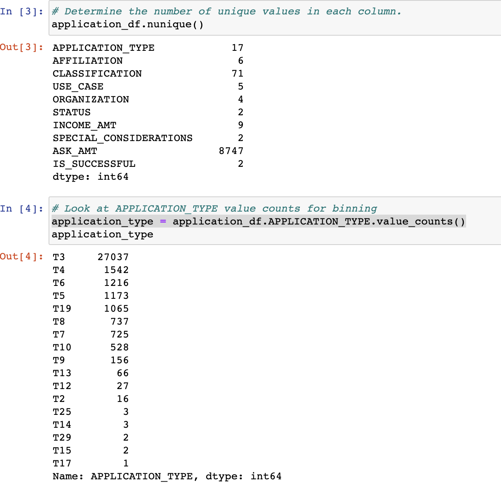
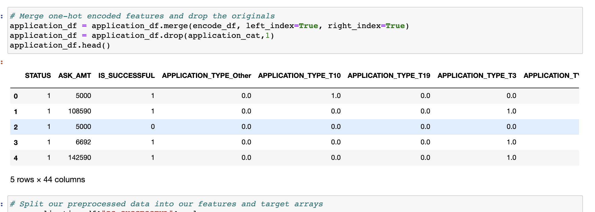

With the pre-processed data set, we scaled the data and built the model using two hidden Relu layers, because this is a non-linear classification problem. We used 80 neurons in the first hidden layer, because there were 44 features and we used 30 features in the second layer.
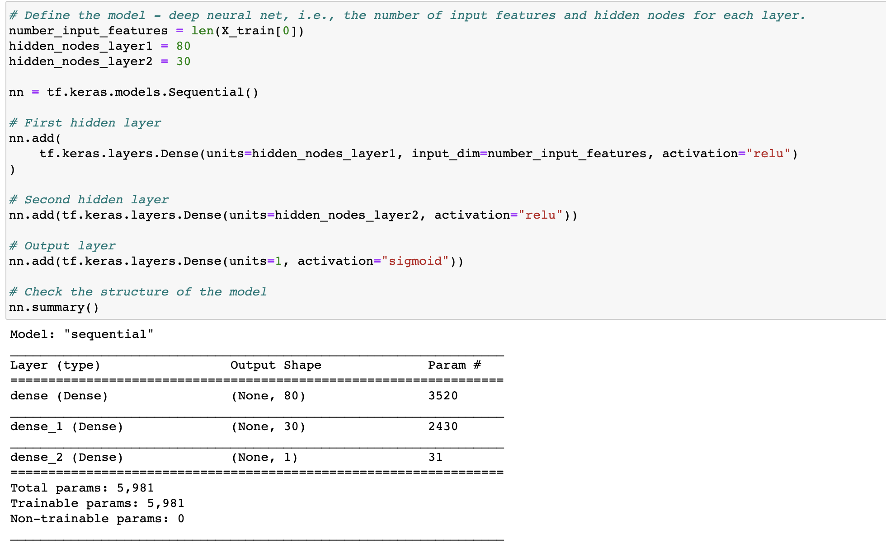

The model performed well and achieved 73% accuracy!
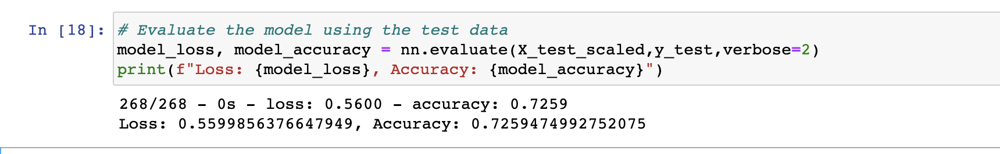

Although 73% accuracy is good, we want to improve the model to at least 75% accuracy. The Jupyter Notebook file only provides five optimizations attempts, but many more attempts were made! In the sections below, we've provided descriptions on the optimization attempts.

##### Optimization Attempt 1: Fail
For the first attempt, we decreased the number of appplication and classification categorical variables by increasing the size of the "Other" group. Unfortunately this worsened the accuracy of the model from 72% to 70%.
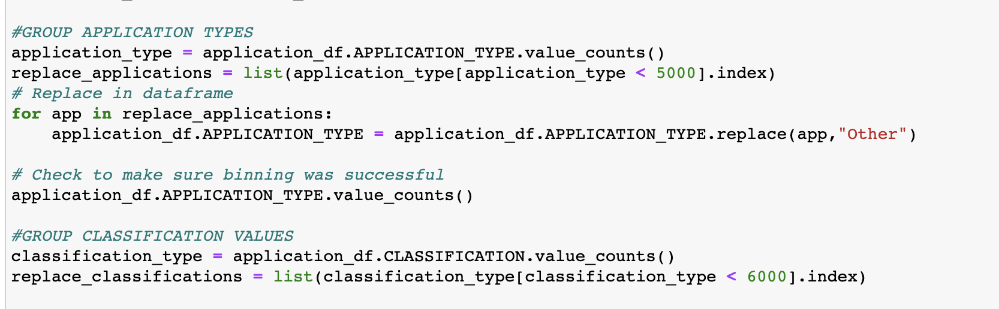
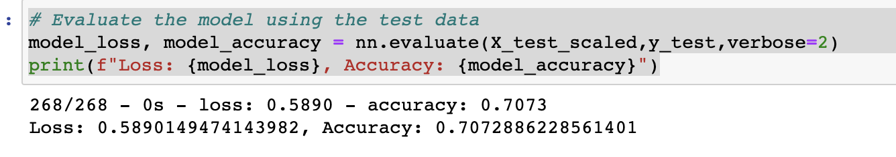

##### Optimization Attempt 2: No Real Change
For the second attempt, we reverted the application and classification categorical variables to their original count. Then we increased the number of hidden layers from 2 to 3 and we added additional nodes to process the data (80 & 30 --> 128, 64, 32). As a result, the accuracy of the model remained approximately the same.
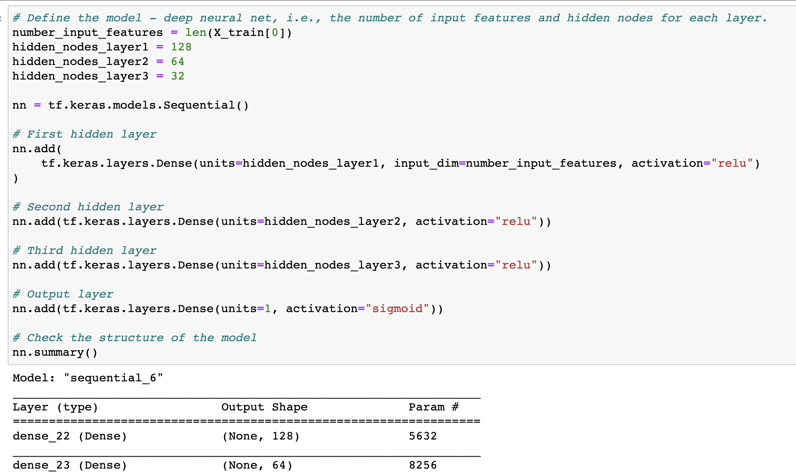
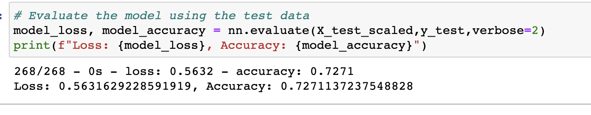

##### Optimization Attempts 3 & 4: No Real Change
For the third and fourth attempt, we used the hidden layer and neuron layers from the second attempt. Then we either increased or decreased the size of the "Other" bucket from the application and classification categorical variables. Unfortunately, attempt 3 worsened the model performance and attempt 4 did not improve performance. We were still below our target of 75%.
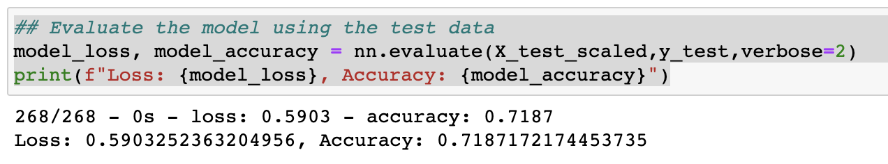
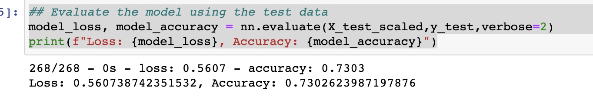

##### Optimization Attempt 5: Mission Accomplished
For the five optimization attempt, we reviewed the ASK_AMT data and reviewed extreme outliers in the dataset. We found a few ask amounts exceeded $4M and decided to drop those rows. 
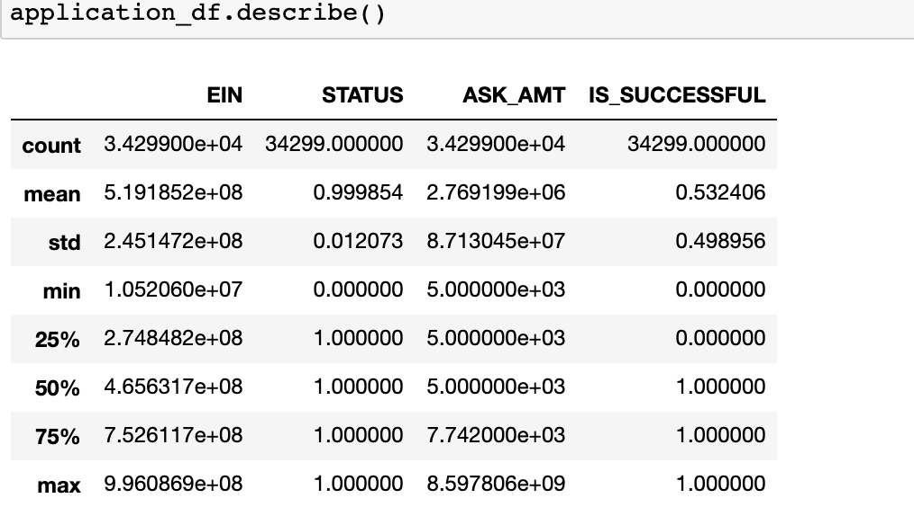

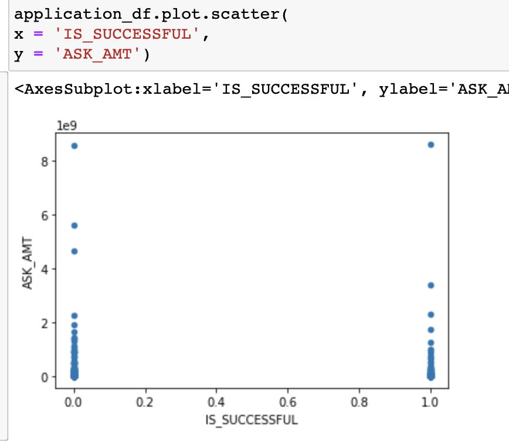

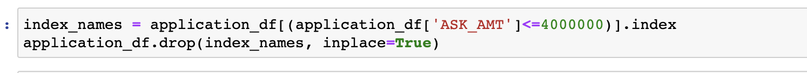

We reverted the application and classification categorical groups to their original state. Then we increased the number of hidden layers from 2 to 3 and we added additional nodes to process the data (80 & 30 --> 128, 64, 32). As a result, the accuracy of the model improved to 75%!
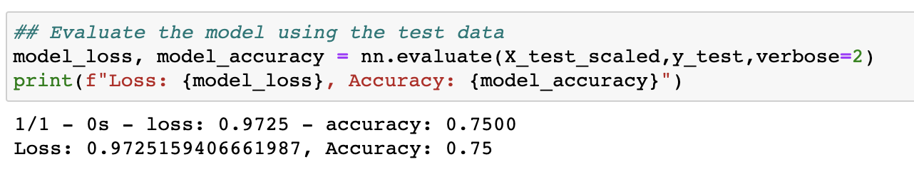

## Summary
By removing outliers from the underlying dataset and increasing the number of layers and neurons in the model, we were able to optimize the deep learning model from 73% accuracy to 75% accuracy.
